# Laboratorio 5 - Cinemática inversa - Robot PhantomX - ROS

## Integrantes

- Hector Daniel Vargas
- Christian Camilo Cuestas Ibáñez
- Juan José Rojas Álvarez

## Análisis de cinemática inversa

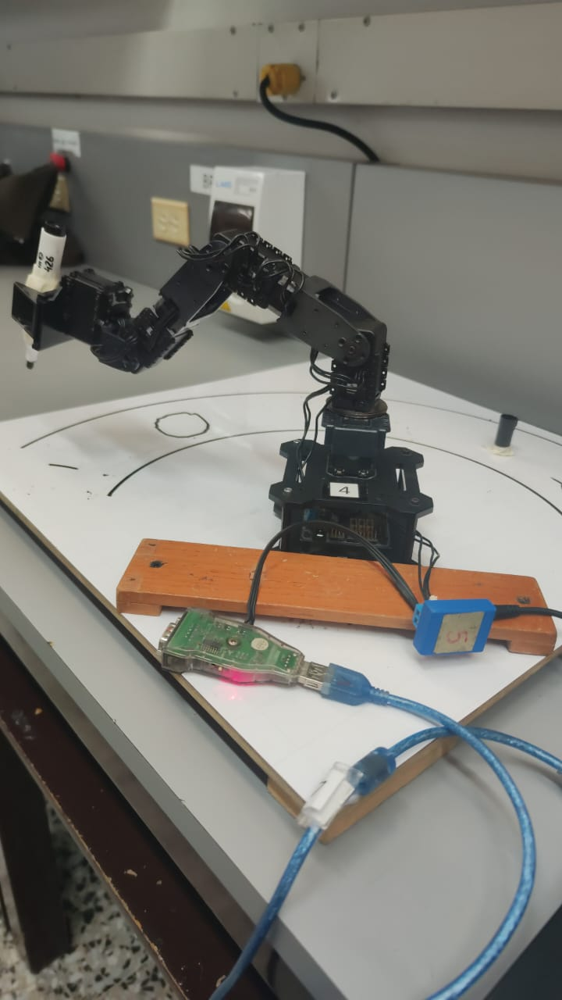{width="600px"}

### Modelo de cinemática inversa

Mediante la implementación de la cinemática inversa del PhantomX, como se muestra en el siguiente código, en el que se encuentran la función 'iKine', con la que se obtuvieron las entradas para el robot para cualquier punto de su zona alcanzable.

```matlab
function q = iKine(P,L,Holding)
    q=zeros(1,5);
    R1=sqrt(P(1)^2+P(2)^2);
    X=R1-L(4);
    Z=P(3)-L(1);
    R=sqrt(X^2+Z^2);
    C3=(R^2-(L(2)^2+L(3)^2))/(2*L(2)*L(3));
    S3=-sqrt(1-C3^2);
    q(3)=atan2(S3,C3);
    K2=L(3)*S3;
    K1=L(2)+L(3)*C3;
    Gamma=atan2(K2,K1);
    Delta=atan2(Z,X);
    q(2)=Delta-Gamma;
    q(1)=atan2(P(2),P(1));
    q(4)=-q(2)-q(3);
    q(5)=0;
    if Holding
        q(5)=deg2rad(-87);
    end
end
```

### Espacio de trabajo del robot:

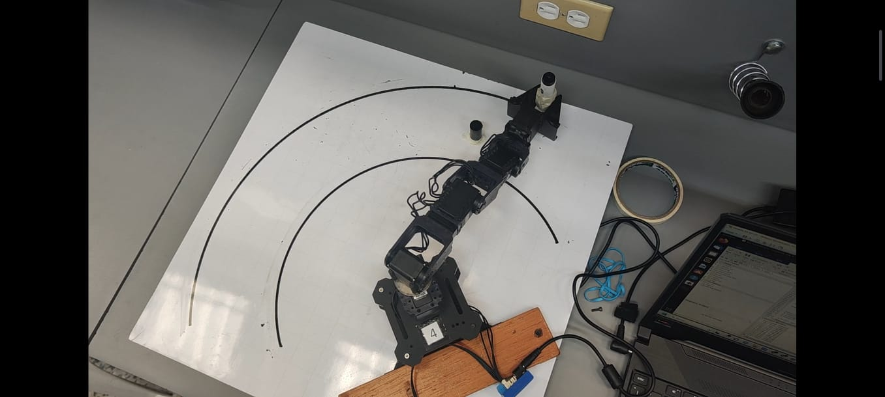{width="600px"}

## Aplicación de escritura 

Teniendo esta función, la cual nos devuelve los parámetros de las articulaciones habiendo definido un punto (x,y,z), planteamos el dibujo de varias figuras mediante el uso de múltiples puntos para que el robot de vaya a la posición punto por punto.

Para esto para cada figura se dibujó un Círculo, Cuadrado o Iniciales. Se creó un código que calcula N puntos para cada figura, definiendo parámetros como su centro y su diámetro y el largo de sus lados. 

Lo anterior se puede encontrar en los códigos:

- Circulo.m
- Cuadrado.m
- Rectangulo.m 

A continuación, el código de 'Rectangulo.m':

```matlab
function Pos=Rectangulo(c,theta,r)
    m=4*r/(2*pi);
    if theta<=pi/4
        Pos=[c(1)+r/2,c(2)+m*theta];
    end
    if theta>=3*pi/4 && theta<=5*pi/4
        Pos=[c(1)-r/2,c(2)-m*(theta-pi)];
    end
    if theta>=7*pi/4
        Pos=[c(1)+r/2,c(2)+m*(theta-2*pi)];
    end
    if  theta>pi/4 && theta<3*pi/4
        Pos=[c(1)-m*(theta-pi/2),c(2)+r/2];
    end
    if  theta>5*pi/4 && theta<7*pi/4
        Pos=[c(1)+m*(theta-3*pi/2),c(2)-r/2];
    end
end
```

### Resultados:

- Circulo:
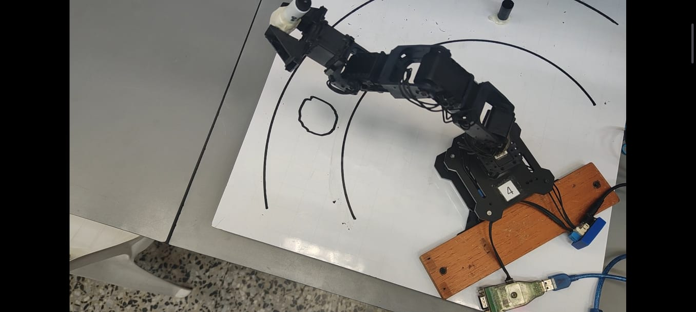{width="600px"}

- Iniciales:
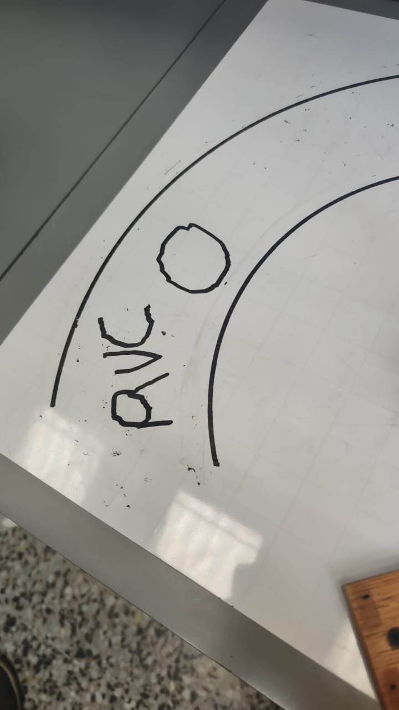{width="600px"}

- Cuadrado
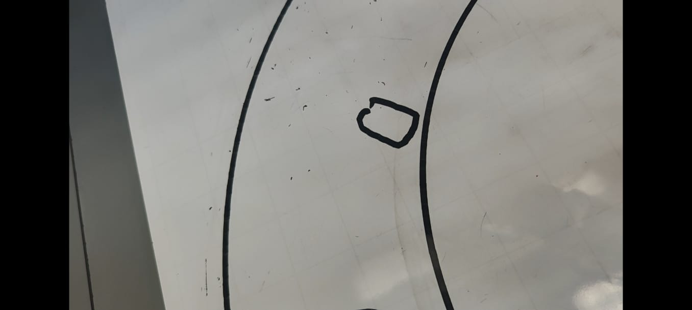{width="600px"}

- Resultados juntos:
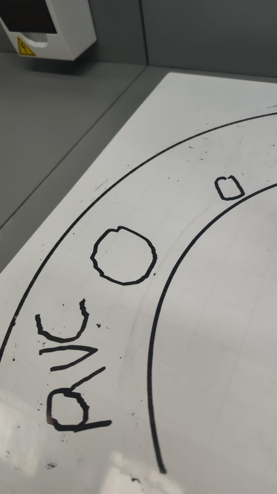{width="600px"}
## Rutinas de escritura

### Base de marcador

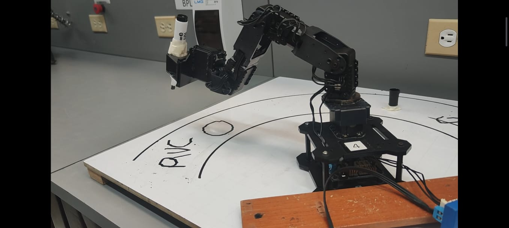{width="600px"}

Como se puede observar, la tapa del marcador es ubicada como base para que el robot tome y deje el marcador en la tapa.


### HMI

Para la implementación del HMI se usó  GUIDE de MATLAB en este se incluyeron diferentes botones. Esto lo podemos ver en la siguiente figura:

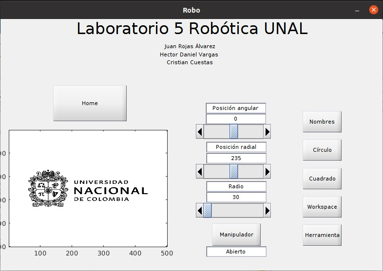{width="600px"}

Otros ejemplos de interfaz de interacción con el robot:
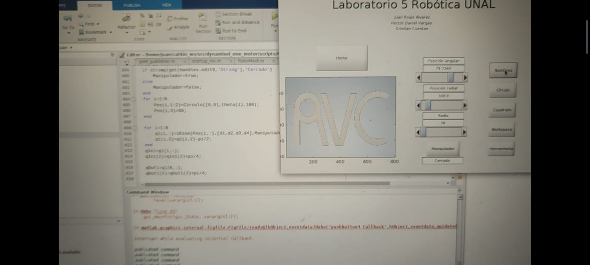{width="600px"}
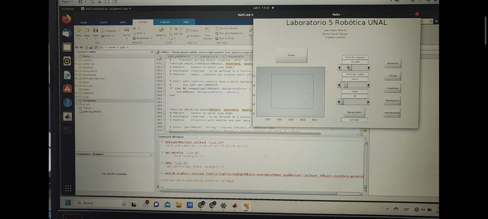{width="600px"}
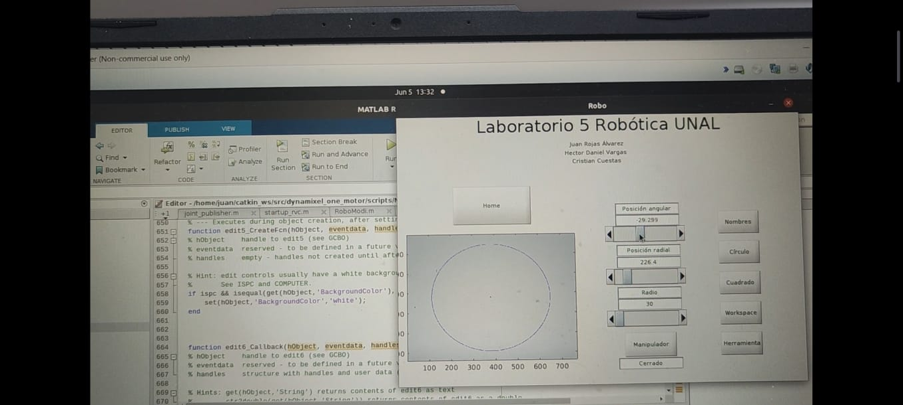{width="600px"}


### Link del video:

Este video muestra la ejecución de las rutinas: [Video](https://youtu.be/s2XSqEUVL0k)
